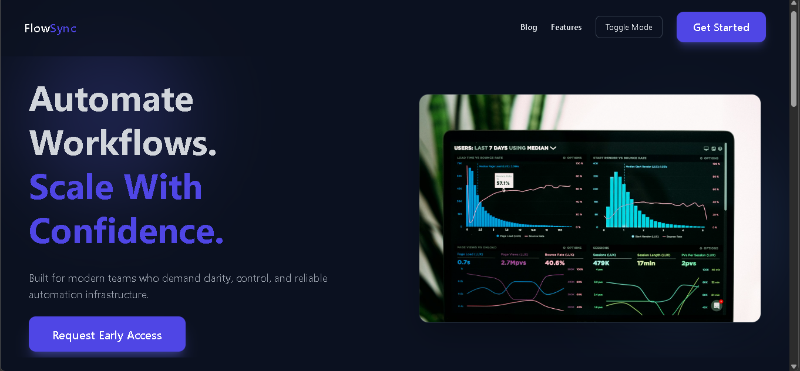
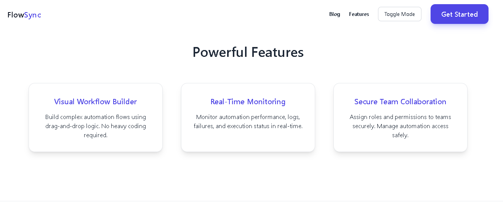
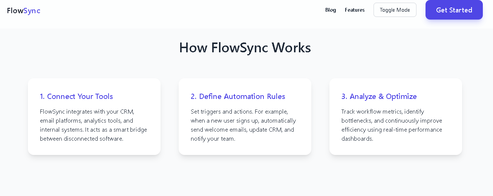
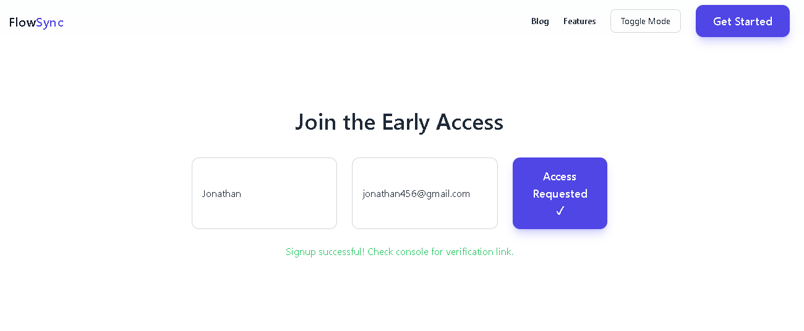
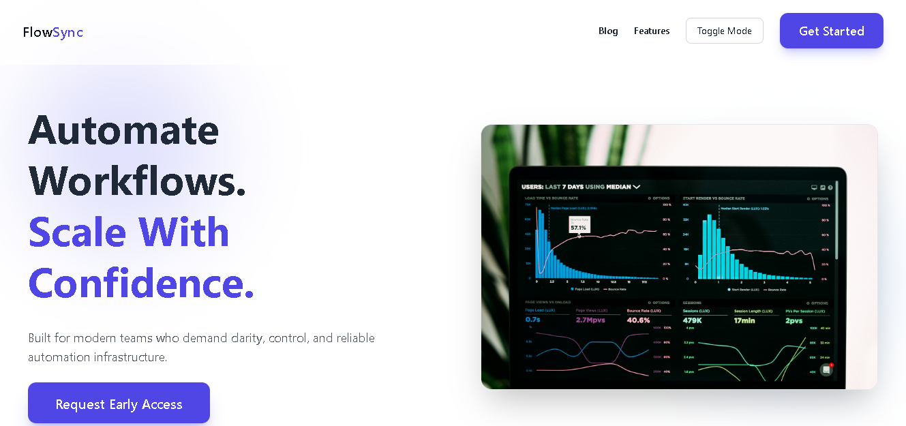
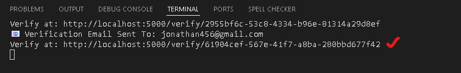
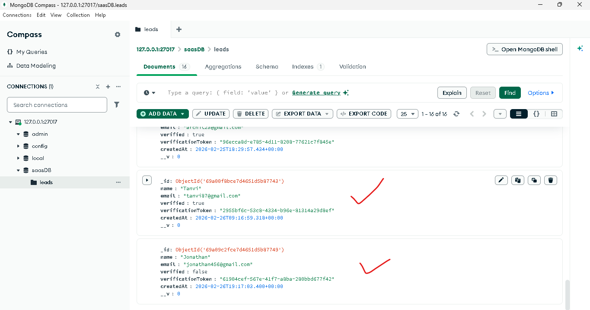
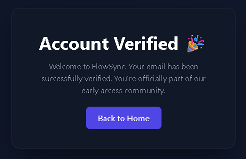

             SaaS Landing Page with Email Verification

1  Project Overview

This project is a SaaS-style landing page with a complete sign-up and email verification workflow. It simulates a real-world SaaS onboarding system with secure backend validation and MongoDB integration.

2  Tech Stack

HTML
Tailwind CSS
Node.js
Express.js
MongoDB
Mongoose
Nodemailer

3  Features

Conversion-optimized SaaS landing design
Lead capture form with validation
Secure email verification system
Token removal after verification
MongoDB user storage
Thank-you dashboard after verification
Dark & Light mode toggle

4  Email Verification Flow

User signs up
Token generated and stored in MongoDB
Verification email sent via Nodemailer
User clicks verification link
Token validated & removed
User marked as verified
Redirected to dashboard

5  Project Structure

/public
  ├── index.html
  ├── thankyou.html
  ├── styles
server.js
.env
package.json

6  How to Run
npm install
node server.js

7  Server runs on:
http://localhost:5000

8  Learning Outcome

This project demonstrates full-stack development skills including frontend UI design, backend authentication workflow, database integration, and production-level security improvements.

##  Project Screenshots

###  Landing Page

---

###  Features Section

---

###  Blog Section

---

###  Access / Sign-Up Section

---

###  Dark / Light Mode Toggle

---

###  Email Verification Link

---

###  Verified User in MongoDB

---

###  After Successful Verification
